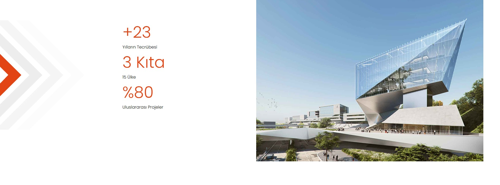
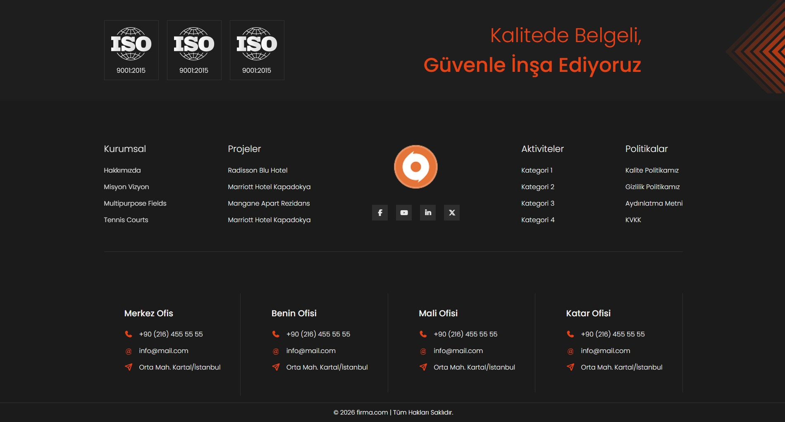

# Future Construction – Tailwind CSS

Future Construction rebuilt with Tailwind CSS.

You can find the previous version here:
[Future Construction – HTML/CSS/JS](https://github.com/Lurzen/future-construction)

## Getting Started

```bash
git clone https://github.com/Lurzen/future-construction-tailwind.git
cd future-construction-tailwind
npm install
npm run dev
```

## Preview


## Header


## Poster


## Stats



## Projects


## Company


## Footer


